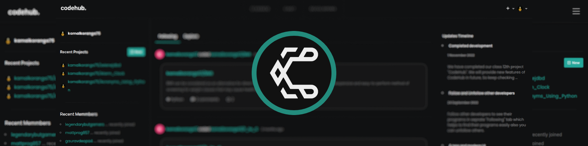
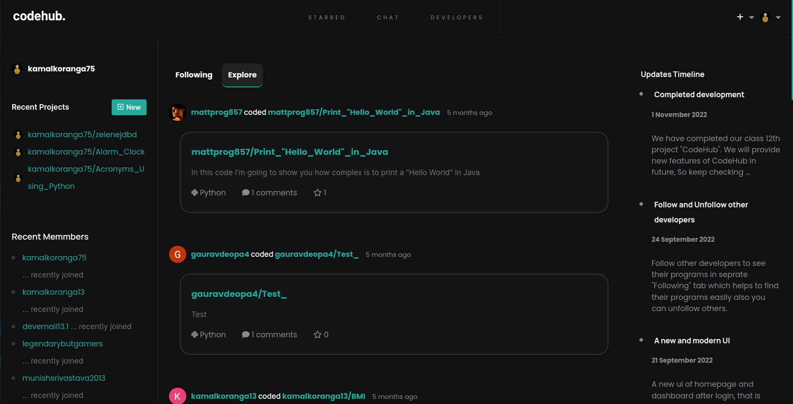

# [Codehub](https://codehub.onrender.com)- Alternative of GitHub

## Inroduction
CodeHub is a full stack web based application project which manages projects or programs of developers, students and teachers. It is an Internet hosting service for project development. It offers a wide range of features, including user-friendliness, developer contributions, and many more. While building this, I mainly focused in its backend part, rather than its ui.

## Features
- Code Hosting
- Follow/Unfollow other developers
- Cross Platform
- Star Programs
- Comments on Programs
- Chat with other developers (Beta)
- Customize your Profile
- Goggle Authintication System
- Developer Support
- Responsive
- Email System

## Tech Stack
Technologies used in building CodeHub:

- **Frontend** -> Html, Css and JS
- **Backend** -> Python (Flask)
- **Database** -> SQL (Postgresql) -> SQLite
- **Hosting** -> Railway

## Dashboard
